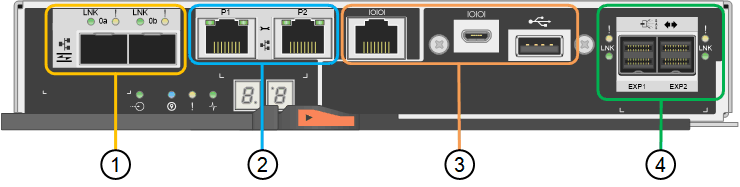

= En el dispositivo StorageGRID 5700
:allow-uri-read: 
:icons: font
:imagesdir: ../media/

[role="lead"]
Los modelos SG5712 y SG5712X de 12 unidades, así como los modelos SG5760 y SG5760X de 60 unidades del dispositivo StorageGRID, incluyen una controladora de computación E5700SG y una controladora de almacenamiento E2800 E-Series.

* SG5712 y SG5760 utilizan controladoras E2800A.
* SG5712X y SG5760X utilizan una controladora E2800B.
+
 The E2800A and E2800B controllers are identical in specification and function except for the location of the interconnect ports.

Debe revisar los diagramas para saber cuáles son las diferencias entre las controladoras.

== Controladora E5700SG

* Funciona como servidor de computación del dispositivo.
* Incluye el instalador de dispositivos StorageGRID.
+

NOTE: El software StorageGRID no está preinstalado en el dispositivo. A este software se accede desde el nodo de administración cuando se implementa el dispositivo.

* Se puede conectar a las tres redes StorageGRID, incluidas la red de cuadrícula, la red de administración y la red de cliente.
* Se conecta a la controladora E2800 y funciona como iniciador.

En esta figura se muestran los conectores de la parte posterior del controlador E5700SG.

image::../media/e5700sg_controller_with_callouts.gif[Conectores en el controlador E5700SG]

|===
|  | Puerto | Tipo | Uso 

 a| 
1
 a| 
Puertos de interconexión 1 y 2
 a| 
Fibre Channel (FC) de 16 GB/s, SFPA óptico
| Conecte la controladora E5700SG a la controladora E2800. 

 a| 
2
 a| 
Puertos de diagnóstico y soporte
 a| 
* Puerto serie RJ-45
* Puerto serie micro USB
* Puerto USB

 a| 
Reservado para soporte técnico.

 a| 
3
 a| 
Puertos de expansión de unidades
 a| 
SAS de 12 GB/s
 a| 
No se utiliza. Los dispositivos StorageGRID no admiten bandejas de unidades de expansión.

 a| 
4
 a| 
Puertos de red 1-4
 a| 
10-GbE o 25-GbE, según el tipo de transceptor SFP, la velocidad del switch y la velocidad de enlace configurada
 a| 
Conéctese a la red de red y a la red de cliente para StorageGRID.

 a| 
5
 a| 
Puerto de gestión 1
 a| 
Ethernet de 1 GB (RJ-45)
 a| 
Conéctese a la red de administración para StorageGRID.

 a| 
6
 a| 
Puerto de gestión 2
 a| 
Ethernet de 1 GB (RJ-45)
 a| 
Opciones:

* Bond con el puerto de gestión 1 para una conexión redundante con la red de administrador para StorageGRID.
* Deje sin cables y disponible para acceso local temporal (IP 169.254.0.1).
* Durante la instalación, utilice el puerto 2 para la configuración de IP si las direcciones IP asignadas por DHCP no están disponibles.

|===

== Controladora de almacenamiento serie E2800

Existen dos versiones de la controladora de almacenamiento E2800 que se utilizan en los dispositivos SG5700: E2800A y E2800B. El E2800A no tiene HIC, y el E2800B tiene una HIC de cuatro puertos. Las dos versiones de controlador tienen especificaciones y funciones idénticas a excepción de la ubicación de los puertos de interconexión.

La controladora de almacenamiento de la serie E2800 tiene las siguientes especificaciones:

* Funciona como controladora de almacenamiento del dispositivo.
* Gestiona el almacenamiento de datos en las unidades.
* Funciona como controladora E-Series estándar en modo simple.
* Incluye software de sistema operativo SANtricity (firmware de la controladora).
* Incluye System Manager de SANtricity para supervisar el hardware del dispositivo y gestionar alertas, la función AutoSupport y la función Drive Security.
* Se conecta a la controladora E5700SG y funciona como objetivo.

Las siguientes figuras muestran los conectores en la parte posterior de las controladoras E2800A y E2800B.

*Conectores en la parte posterior del E2800A*

*Conectores en la parte posterior del E2800B*

image::../media/e2800B_controller_with_callouts.gif[Conectores en el controlador E2800B]

|===
|  | Puerto | Tipo | Uso 

 a| 
1
 a| 
Puertos de interconexión 1 y 2
 a| 
SFPA óptico FC de 16 GB/s
| Conecte la controladora E2800 a la controladora E5700SG. 

 a| 
2
 a| 
Puertos de gestión 1 y 2
 a| 
Ethernet de 1 GB (RJ-45)
 a| 
* Opciones del puerto 1:
+
** Conéctese a una red de gestión para habilitar el acceso TCP/IP directo a System Manager de SANtricity
** Deje sin cables para guardar un puerto del switch y una dirección IP. Acceda a SANtricity System Manager usando las interfaces de usuario del instalador de Grid Manager o Storage Grid Appliance.

*Nota*: Algunas funciones opcionales de SANtricity, como sincronización NTP para marcas de hora de registro precisas, no están disponibles cuando elige dejar el puerto 1 sin cable.

*Nota*: Se requiere StorageGRID 11.5 o superior, y SANtricity 11.70 o superior, cuando salga del Puerto 1 sin cables.

* El puerto 2 está reservado para uso del soporte técnico.

 a| 
3
 a| 
Puertos de diagnóstico y soporte
 a| 
* Puerto serie RJ-45
* Puerto serie micro USB
* Puerto USB

 a| 
Reservado para uso del soporte técnico.

 a| 
4
 a| 
Puertos de expansión de unidades.
 a| 
SAS de 12 GB/s
 a| 
No se utiliza.

|===