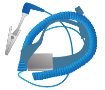

= Obtener equipamiento y herramientas adicionales (SG5700)
:allow-uri-read: 
:icons: font
:imagesdir: ../media/

[role="lead"]
Antes de instalar el aparato StorageGRID, confirme que dispone de todos los equipos y herramientas adicionales que necesita.

Necesitará el siguiente equipo adicional para instalar y configurar el hardware:

* *Destornilladores*
+
image::../media/screwdrivers.gif[Dos destornilladores]

+
Phillips no 2 destornillador

+
Destornillador plano medio

* *Muñequera ESD*
+

* *Cables ópticos y transceptores SFP*
+
image::../media/fc_cable_and_sfp.gif[Cable óptico y transceptor SFP+]

+
Cables ópticos para los puertos 10/25-GbE que tiene previsto utilizar

+
Opcional: Transceptores SFP28 si desea utilizar velocidad de enlace 25-GbE

* *Cables Ethernet*
+
image::../media/ethernet_cables.png[Cables Ethernet]

* *Portátil de servicio*
+
image::../media/sam_management_client.gif[Portátil de servicio]

+
xref:../admin/web-browser-requirements.adoc[Navegador web compatible]

+
Cliente SSH, como PuTTY

+
Puerto Ethernet de 1 GB (RJ-45)

* *Herramientas opcionales*
+
image::../media/optional_tools.gif[Taladro eléctrico y linterna]

+
Taladro eléctrico con punta Phillips

+
Linterna

+
Elevación mecanizada para SG5760

