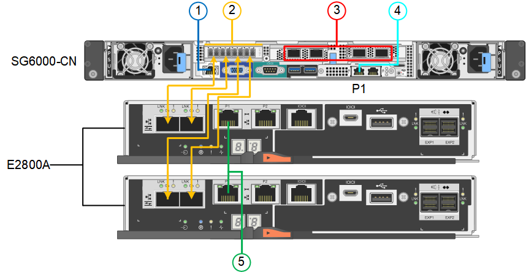

= Aparato de cable (SG6000)
:allow-uri-read: 
:icons: font
:imagesdir: ../media/

[role="lead"]
Debe conectar los controladores de almacenamiento al controlador SG6000-CN, conectar los puertos de administración de los tres controladores y conectar los puertos de red del controlador SG6000-CN a la red de cuadrícula y a la red de cliente opcional para StorageGRID.

.Lo que necesitará
* Dispone de los cuatro cables ópticos suministrados con el aparato para conectar los dos controladores de almacenamiento al controlador SG6000-CN.
* Tiene cables Ethernet RJ-45 (cuatro mínimos) para conectar los puertos de administración.
* Tiene una de las siguientes opciones para los puertos de red. Estos artículos no se proporcionan con el aparato.
+
** De uno a cuatro cables Twinax para conectar los cuatro puertos de red.
** De uno a cuatro transceptores SFP+ o SFP28 si planea utilizar cables ópticos para los puertos.
+

CAUTION: *Riesgo de exposición a la radiación láser* -- no desmonte ni retire ninguna parte de un transceptor SFP. Puede que esté expuesto a la radiación láser.

.Acerca de esta tarea
En esta sección se proporcionan instrucciones para el cableado de los siguientes dispositivos:

* SG6060 y SG6060X
* SGF6024

== Conecte el cable SG6060 o SG6060X

Las siguientes figuras muestran las tres controladoras en los dispositivos SG6060 y SG6060X, con el controlador de computación SG6000-CN en la parte superior y las dos controladoras de almacenamiento E2800 en la parte inferior.

NOTE: El SG6060 tiene controladores E2800A y la SG606060X tiene controladoras E2800B. Ambas versiones de la controladora E2800 tienen especificaciones y funciones idénticas a excepción de la ubicación de los puertos de interconexión.

CAUTION: No use las controladoras E2800A y E2800B en el mismo dispositivo.

*SG6060 a E2800A conexiones*

*Conexiones SG606060X a E2800B*

image::../media/sg6000x_e2800B_connections.png[Conexiones SG6060 a E2800B]

== Conecte el cable SGF6024

La siguiente figura muestra las tres controladoras del dispositivo SGF6024, con el controlador de computación SG6000-CN en la parte superior y las dos controladoras de almacenamiento EF570 en paralelo debajo del controlador de computación.

image::../media/sg6000_ef570_connections.png[Conexiones SG6000 a SGF570]

[cols="1a,2a,2a,3a"]
|===
|  | Puerto | Tipo de puerto | Función 

 a| 
1
 a| 
Puerto de gestión de BMC en el controlador SG6000-CN
 a| 
1 GbE (RJ-45).
 a| 
Se conecta a la red en la que se accede a la interfaz del BMC.

 a| 
2
 a| 
Puertos de conexión FC:

* 4 en el controlador SG6000-CN
* 2 en cada controladora de almacenamiento

 a| 
SFP+ óptico FC de 16 GB/s
 a| 
Conecte cada controlador de almacenamiento al controlador SG6000-CN.

 a| 
3
 a| 
Cuatro puertos de red en el controlador SG6000-CN
 a| 
10/25 GbE
 a| 
Conéctese a la red de red y a la red de cliente para StorageGRID.

 a| 
4
 a| 
Puerto de red de administración en el controlador SG6000-CN (con la etiqueta P1 en la figura)
 a| 
1 GbE (RJ-45).

*Importante:* este puerto funciona sólo a 1000 BaseT/full y no admite velocidades de 10 o 100 megabits.
 a| 
Conecta el controlador SG6000-CN a la red de administración para StorageGRID.

 a| 
 a| 
Puerto RJ-45 derecho en el controlador SG6000-CN
 a| 
1 GbE (RJ-45).

*Importante:* este puerto funciona sólo a 1000 BaseT/full y no admite velocidades de 10 o 100 megabits.
 a| 
* Se puede unir al puerto de administración 1 si desea una conexión redundante a la red de administración.
* Puede dejarse sin cables y disponible para acceso local temporal (IP 169.254.0.1).
* Durante la instalación, se puede utilizar para conectar el controlador SG6000-CN a un portátil de servicio si las direcciones IP asignadas por DHCP no están disponibles.

 a| 
5
 a| 
Puerto de gestión 1 en cada controladora de almacenamiento
 a| 
1 GbE (RJ-45).
 a| 
Se conecta a la red en la que se accede a System Manager de SANtricity.

 a| 
 a| 
Puerto de gestión 2 en cada controladora de almacenamiento
 a| 
1 GbE (RJ-45).
 a| 
Reservado para soporte técnico.

|===
.Pasos
. Conecte el puerto de administración de BMC del controlador SG6000-CN a la red de administración mediante un cable Ethernet.
+
Aunque esta conexión es opcional, se recomienda facilitar el soporte.

. Conecte los dos puertos FC de cada controlador de almacenamiento a los puertos FC de la controladora SG6000-CN, utilizando cuatro cables ópticos y cuatro transceptores SFP+ para las controladoras de almacenamiento.
. Conecte los puertos de red del controlador SG6000-CN a los switches de red adecuados utilizando cables Twinax o cables ópticos y transceptores SFP+ o SFP28.
+

NOTE: Los cuatro puertos de red deben usar la misma velocidad de enlace. Instale transceptores SFP+ si tiene pensado utilizar velocidades de enlace 10-GbE. Instale transceptores SFP28 si tiene pensado utilizar velocidades de enlace 25-GbE.

+
** Si piensa utilizar el modo de enlace de puerto fijo (predeterminado), conecte los puertos a la red de StorageGRID y a las redes de cliente, como se muestra en la tabla.
+
|===
| Puerto | Conecta a... 

 a| 
Puerto 1
 a| 
Red de cliente (opcional)

 a| 
Puerto 2
 a| 
Red Grid

 a| 
Puerto 3
 a| 
Red de cliente (opcional)

 a| 
Puerto 4
 a| 
Red Grid

|===
** Si planea utilizar el modo de enlace de puerto agregado, conecte uno o varios puertos de red a uno o varios switches. Debe conectar al menos dos de los cuatro puertos para evitar tener un único punto de error. Si utiliza más de un switch para un único vínculo LACP, los switches deben ser compatibles con MLAG o equivalente.

. Si tiene previsto utilizar la Red de administración para StorageGRID, conecte el puerto Red de administración del controlador SG6000-CN a la Red de administración, mediante un cable Ethernet.
. Si tiene pensado utilizar la red de gestión para SANtricity System Manager, conecte el puerto de gestión 1 (P1 en el E2800A y 0a en el E2800B) en cada controladora de almacenamiento (el puerto RJ-45 a la izquierda) a la red de gestión para SANtricity System Manager, utilizando un cable Ethernet.
+
No utilice el puerto de gestión 2 (P2 en E2800A y 0b en E2800B) en la controladora de almacenamiento (el puerto RJ-45 a la derecha). Este puerto está reservado para el soporte técnico.

.Información relacionada
xref:port-bond-modes-for-sg6000-cn-controller.adoc[Modos de enlace de puertos para el controlador SG6000-CN]

xref:reinstalling-sg6000-cn-controller-into-cabinet-or-rack.adoc[Vuelva a instalar el controlador SG6000-CN en el armario o bastidor]
