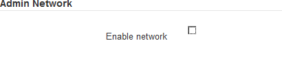

= Configuración de enlaces de red (serie SG6000)
:allow-uri-read: 
:icons: font
:imagesdir: ../media/

[role="lead"]
Puede configurar los enlaces de red para los puertos utilizados para conectar el dispositivo a la red de grid, la red de cliente y la red de administración. Puede establecer la velocidad de enlace, así como los modos de enlace de red y puerto.

.Lo que necesitará
Si clona un nodo de un dispositivo, configure los enlaces de red del dispositivo de destino para todos los enlaces que use el nodo del dispositivo de origen.

Si tiene previsto utilizar una velocidad de enlace de 25 GbE:

* Está utilizando cables SFP28 Twinax o ha instalado transceptores SFP28 en los puertos de red que va a utilizar.
* Ya debe haber conectado los puertos de red a los switches que puedan admitir estas funciones.
* Comprende cómo configurar los switches para que utilicen esta mayor velocidad.

Si planea utilizar el modo de enlace de puerto de agregado, el modo de enlace de red LACP o el etiquetado de VLAN:

* Conectó los puertos de red del dispositivo a los switches que admiten VLAN y LACP.
* Si varios switches participan en el enlace LACP, los switches admiten grupos de agregación de enlaces de varios chasis (MLAG) o equivalente.
* Comprende cómo configurar los switches para que utilicen VLAN, LACP y MLAG o equivalente.
* Conoce la etiqueta de VLAN única que se utilizará para cada red. Esta etiqueta VLAN se añadirá a cada paquete de red para garantizar que el tráfico de red se dirija a la red correcta.

.Acerca de esta tarea
En esta figura, se muestra cómo los cuatro puertos de red se vinculan en modo de enlace de puerto fijo (configuración predeterminada).

image::../media/sg6000_cn_fixed_port.gif[Imagen que muestra cómo los puertos de red del controlador SG6000-CN están Unidos en modo fijo]

[cols="1a,3a"]
|===
| Llamada | Qué puertos están Unidos 

 a| 
C
 a| 
Los puertos 1 y 3 se unen para la red cliente, si se utiliza esta red.

 a| 
G
 a| 
Los puertos 2 y 4 están Unidos para la red de cuadrícula.

|===
En esta figura, se muestra cómo los cuatro puertos de red están Unidos en el modo de enlace de puerto agregado.

image::../media/sg6000_cn_aggregate_port.gif[Imagen que muestra cómo los puertos de red del controlador SG6000-CN están Unidos en modo agregado]

[cols="1a,3a"]
|===
| Llamada | Qué puertos están Unidos 

 a| 
1
 a| 
Los cuatro puertos se agrupan en un enlace LACP único, lo que permite que se usen todos los puertos para el tráfico de red de grid y de red de cliente.

|===
En las tablas, se resumen las opciones para configurar los cuatro puertos de red. La configuración predeterminada se muestra en negrita. Sólo tiene que configurar los ajustes en la página Configuración de vínculos si desea utilizar un valor no predeterminado.

* *Modo de enlace de puerto fijo (predeterminado)*
+
[cols="1a,3a,3a"]
|===
| Modo de enlace de red | Red de cliente desactivada (predeterminada) | Red de cliente habilitada 

 a| 
Active-Backup (predeterminado)
 a| 
** Los puertos 2 y 4 utilizan un vínculo de copia de seguridad activa para la red Grid.
** Los puertos 1 y 3 no se usan.
** Una etiqueta de VLAN es opcional.

 a| 
** Los puertos 2 y 4 utilizan un vínculo de copia de seguridad activa para la red Grid.
** Los puertos 1 y 3 utilizan un vínculo de backup activo para la red cliente.
** Es posible especificar etiquetas de VLAN para ambas redes.

 a| 
LACP (802.3ad)
 a| 
** Los puertos 2 y 4 utilizan un enlace LACP para la red de grid.
** Los puertos 1 y 3 no se usan.
** Una etiqueta de VLAN es opcional.

 a| 
** Los puertos 2 y 4 utilizan un enlace LACP para la red de grid.
** Los puertos 1 y 3 utilizan un enlace LACP para la red de cliente.
** Es posible especificar etiquetas de VLAN para ambas redes.

|===
* *Modo de enlace de puerto agregado*
+
[cols="1a,3a,3a"]
|===
| Modo de enlace de red | Red de cliente desactivada (predeterminada) | Red de cliente habilitada 

 a| 
Solo LACP (802.3ad)
 a| 
** Los puertos 1-4 utilizan un enlace LACP único para la red de grid.
** Una única etiqueta VLAN identifica los paquetes de red Grid.

 a| 
** Los puertos 1-4 utilizan un enlace LACP único para la red de grid y la red de cliente.
** Dos etiquetas VLAN permiten que los paquetes de red de cuadrícula se separen de los paquetes de red de cliente.

|===

Consulte xref:port-bond-modes-for-sg6000-cn-controller.adoc[Modos de enlace de puertos para el controlador SG6000-CN] para obtener más información acerca de los modos de enlace de puerto y enlace de red.

Esta figura muestra cómo los dos puertos de gestión de 1 GbE del controlador SG6000-CN están Unidos en el modo de enlace de red Active-Backup para la red Admin.

image::../media/sg6000_cn_bonded_managemente_ports.gif[Puertos de red de administración con conexión]

.Pasos
. En el instalador del dispositivo StorageGRID, haga clic en *Configurar la red* *Configuración del enlace*.
+
La página Network Link Configuration muestra un diagrama del dispositivo con los puertos de red y administración numerados.

+
image::../media/sg6060_configuring_network_ports.png[Puertos de red SG6060]

+
La tabla Estado del enlace muestra el estado de los vínculos (arriba/abajo) y la velocidad (1/10/25/40/100 Gbps) de los puertos numerados.

+
image::../media/sg6060_configuring_network_linkstatus.png[Tabla de estado de enlace]

+
La primera vez que acceda a esta página:

+
** *Velocidad de enlace* se ajusta en *Auto*.
** *El modo de enlace de puerto* está establecido en *fijo*.
** *El modo de enlace de red* se establece en *Active-Backup* para la red de cuadrícula.
** La *Red de administración* está activada y el modo de enlace de red se establece en *independiente*.
** La *Red cliente* está desactivada.
+
image::../media/network_link_configuration_fixed.png[Configuración fija de Network Link]

. Si planea utilizar la velocidad de enlace de 25 GbE para los puertos de red, seleccione *Auto* en la lista desplegable velocidad de enlace.
+
Los switches de red que utiliza para la red de cuadrícula y la red de cliente también deben ser compatibles y configurados para esta velocidad. Debe utilizar cables Twinax o cables ópticos de SFP28 y transceptores SFP28.

. Habilite o deshabilite las redes StorageGRID que tiene previsto utilizar.
+
Se requiere la red de red. No se puede deshabilitar esta red.

+
.. Si el dispositivo no está conectado a la red de administración, anule la selección de la casilla de verificación *Activar red* para la red de administración.
+

.. Si el dispositivo está conectado a la red cliente, seleccione la casilla de verificación *Activar red* de la red cliente.
+
Ahora se muestran los ajustes de red de cliente para los puertos de red.

. Consulte la tabla y configure el modo de enlace de puerto y el modo de enlace de red.
+
Este ejemplo muestra:

+
** *Agregado* y *LACP* seleccionados para las redes Grid y Client. Debe especificar una etiqueta de VLAN exclusiva para cada red. Puede seleccionar valores entre 0 y 4095.
** *Active-Backup* seleccionado para la red de administración.
+
image::../media/network_link_configuration_aggregate.gif[Captura de pantalla que muestra los ajustes de configuración de vínculos para el modo agregado]

. Cuando esté satisfecho con sus selecciones, haga clic en *Guardar*.
+

NOTE: Puede perder la conexión si ha realizado cambios en la red o el enlace que está conectado a través de. Si no vuelve a conectarse en un minuto, vuelva a introducir la URL del instalador de dispositivos de StorageGRID utilizando uno del otro xref:configuring-storagegrid-ip-addresses-sg6000.adoc[Direcciones IP] asignado al dispositivo: `*https://_SG6000-CN_Controller_IP_:8443*`

