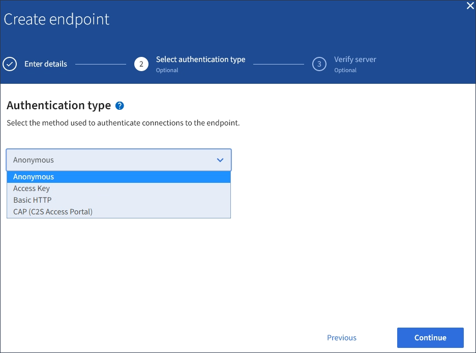

= Cree un extremo de servicios de plataforma
:allow-uri-read: 
:icons: font
:imagesdir: ../media/

[role="lead"]
Debe crear al menos un extremo del tipo correcto para poder habilitar un servicio de plataforma.

.Lo que necesitará
* Debe iniciar sesión en el administrador de inquilinos mediante un xref:../admin/web-browser-requirements.adoc[navegador web compatible].
* Un administrador de StorageGRID debe habilitar los servicios de plataforma para su cuenta de inquilino.
* Debe pertenecer a un grupo de usuarios que tenga el permiso Administrar endpoints.
* Se debe haber creado el recurso al que hace referencia el extremo de servicios de la plataforma:
+
** Replicación de CloudMirror: Bloque de S3
** Notificación de eventos: Tema SNS
** Notificación de búsqueda: Índice de Elasticsearch, si el clúster de destino no está configurado para crear índices automáticamente.

* Debe tener la información sobre el recurso de destino:
+
** Host y puerto para el Identificador uniforme de recursos (URI)
+

NOTE: Si piensa utilizar un bloque alojado en un sistema StorageGRID como extremo para la replicación de CloudMirror, póngase en contacto con el administrador de grid para determinar los valores que debe introducir.

** Nombre del recurso único (URN)
+
xref:specifying-urn-for-platform-services-endpoint.adoc[Especifique URN para el extremo de servicios de la plataforma]

** Credenciales de autenticación (si es necesario):
+
*** Clave de acceso: ID de clave de acceso y clave de acceso secreta
*** Basic HTTP: Nombre de usuario y contraseña
*** CAP (C2S Access Portal): URL de credenciales temporales, certificados de servidor y de cliente, claves de cliente y una contraseña de clave privada de cliente opcional.

** Certificado de seguridad (si se utiliza un certificado de CA personalizado)

.Pasos
. Seleccione *STORAGE (S3)* > *Platform Services Endpoints*.
+
Aparece la página de extremos de servicios de plataforma.

+
image::../media/endpoints_page_blank.png[Página en blanco de los extremos de los servicios de plataforma]

. Seleccione *Crear punto final*.
+
image::../media/endpoint_create.png[Create Endpoint]

. Introduzca un nombre para mostrar para describir brevemente el extremo y su propósito.
+
El tipo de servicio de plataforma que admite el extremo se muestra junto al nombre del extremo cuando se muestra en la página de extremos, por lo que no es necesario incluir esa información en el nombre.

. En el campo *URI*, especifique el Identificador de recursos único (URI) del extremo.
+
Utilice uno de los siguientes formatos:

+
[listing]
----
https://host:port
http://host:port
----
+
Si no especifica un puerto, el puerto 443 se utiliza para los URI HTTPS y el puerto 80 se utiliza para los URI HTTP.

+
Por ejemplo, el URI para un bloque alojado en StorageGRID podría ser:

+
[listing]
----
https://s3.example.com:10443
----
+
En este ejemplo: `s3.example.com` Representa la entrada DNS para la IP virtual (VIP) del grupo de alta disponibilidad (ha) de StorageGRID, y. `10443` representa el puerto definido en el extremo del equilibrador de carga.

+

NOTE: Siempre que sea posible, debe conectarse a un grupo de alta disponibilidad de nodos de equilibrio de carga para evitar un único punto de error.

+
Del mismo modo, el URI para un bloque alojado en AWS podría ser:

+
[listing]
----
https://s3-aws-region.amazonaws.com
----
+

NOTE: Si se utiliza el extremo para el servicio de replicación de CloudMirror, no incluya el nombre de bloque en el URI. Incluye el nombre de bloque en el campo *URN*.

. Introduzca el nombre de recurso único (URN) para el extremo.
+

NOTE: No es posible cambiar el URN de un extremo una vez que se creó el extremo.

. Seleccione *continuar*.
. Seleccione un valor para *Tipo de autenticación* y, a continuación, introduzca o cargue las credenciales necesarias.
+

+
Las credenciales que proporcione deben tener permisos de escritura para el recurso de destino.

+
[cols="1a,2a,2a"]
|===
| Tipo de autenticación | Descripción | Credenciales 

 a| 
Anónimo
 a| 
Proporciona acceso anónimo al destino. Solo funciona para extremos con seguridad deshabilitada.
 a| 
Sin autenticación.

 a| 
Clave de acceso
 a| 
Usa credenciales de estilo AWS para autenticar conexiones con el destino.
 a| 
** ID de clave de acceso
** Clave de acceso secreta

 a| 
HTTP básico
 a| 
Utiliza un nombre de usuario y una contraseña para autenticar las conexiones al destino.
 a| 
** Nombre de usuario
** Contraseña

 a| 
CAP (Portal de acceso C2S)
 a| 
Usa certificados y claves para autenticar las conexiones al destino.
 a| 
** URL de credenciales temporales
** Certificado de CA de servidor (carga de archivo PEM)
** Certificado de cliente (carga de archivo PEM)
** Clave privada de cliente (carga de archivo PEM, formato cifrado OpenSSL o formato de clave privada no cifrado)
** Contraseña de clave privada de cliente (opcional)

|===
. Seleccione *continuar*.
. Seleccione un botón de opción para *verificar servidor* para elegir cómo se verifica la conexión TLS con el extremo.
+
image::../media/endpoint_create_verify_server.png[Crear punto final - Validar certificado]

+
[cols="1a,2a"]
|===
| Tipo de verificación del certificado | Descripción 

 a| 
Utilizar certificado de CA personalizado
 a| 
Usar un certificado de seguridad personalizado. Si selecciona esta opción, copie y pegue el certificado de seguridad personalizado en el cuadro de texto *Certificado CA*.

 a| 
Utilizar certificado de CA del sistema operativo
 a| 
Utilice el certificado de CA de cuadrícula predeterminado instalado en el sistema operativo para asegurar las conexiones.

 a| 
No verifique el certificado
 a| 
El certificado utilizado para la conexión TLS no se verifica. Esta opción no es segura.

|===
. Seleccione *probar y crear punto final*.
+
** Aparece un mensaje de éxito si se puede acceder al extremo con las credenciales especificadas. La conexión con el extremo se valida desde un nodo en cada sitio.
** Aparece un mensaje de error si se produce un error en la validación del extremo. Si necesita modificar el punto final para corregir el error, seleccione *Volver a los detalles del punto final* y actualice la información. A continuación, seleccione *probar y crear punto final*.
+

NOTE: Se produce un error en la creación de extremos si los servicios de plataforma no están habilitados para su cuenta de inquilino. Póngase en contacto con el administrador de StorageGRID.

Una vez que haya configurado un extremo, puede utilizar su URN para configurar un servicio de plataforma.

.Información relacionada
xref:specifying-urn-for-platform-services-endpoint.adoc[Especifique URN para el extremo de servicios de la plataforma]

xref:configuring-cloudmirror-replication.adoc[Configure la replicación de CloudMirror]

xref:configuring-event-notifications.adoc[Configure las notificaciones de eventos]

xref:configuring-search-integration-service.adoc[Configure el servicio de integración de búsqueda]
