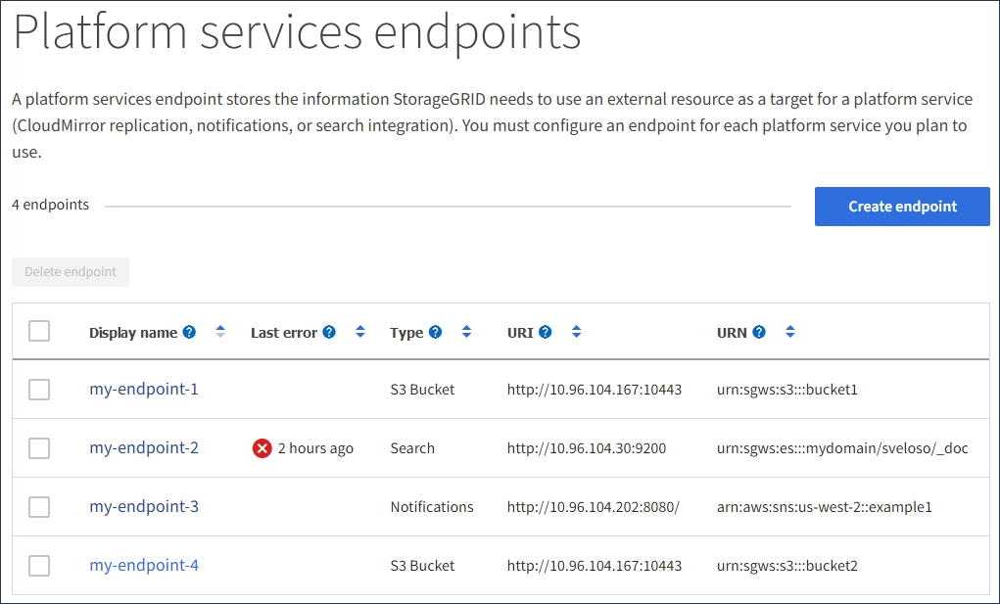

= Eliminar extremo de servicios de plataforma
:allow-uri-read: 
:icons: font
:imagesdir: ../media/

[role="lead"]
Puede eliminar un extremo si ya no desea utilizar el servicio de plataforma asociado.

.Lo que necesitará
* Debe iniciar sesión en el administrador de inquilinos mediante un xref:../admin/web-browser-requirements.adoc[navegador web compatible].
* Debe pertenecer a un grupo de usuarios que tenga el permiso *Administrar endpoints*. Consulte xref:tenant-management-permissions.adoc[Permisos de gestión de inquilinos].

.Pasos
. Seleccione *STORAGE (S3)* > *Platform Services Endpoints*.
+
Aparece la página de extremos de servicios de plataforma y muestra la lista de extremos de servicios de plataforma que ya se han configurado.

+

. Seleccione la casilla de comprobación de cada extremo que desea eliminar.
+

IMPORTANT: Si elimina un extremo de servicios de plataforma que está en uso, el servicio de plataforma asociado se deshabilitará para todos los bloques que utilicen el extremo. Se descartarán las solicitudes que aún no se hayan completado. Se continuarán generando todas las solicitudes nuevas hasta que cambie la configuración de bloque para que ya no haga referencia a URN eliminado. StorageGRID informará de estas solicitudes como errores irrecuperables.

. Seleccione *acciones* > *Eliminar punto final*.
+
Aparecerá un mensaje de confirmación.

+
image::../media/endpoint_delete_confirm.png[Confirmación de eliminación de punto final]

. Seleccione *Eliminar punto final*.

