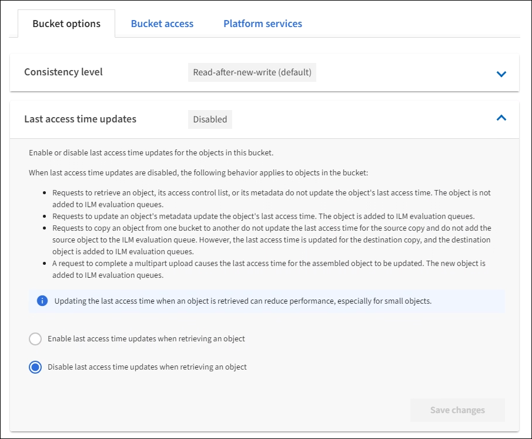

= Activar o desactivar las actualizaciones de la hora del último acceso
:allow-uri-read: 
:icons: font
:imagesdir: ../media/

[role="lead"]
Cuando los administradores de grid crean las reglas de gestión del ciclo de vida de la información (ILM) para un sistema StorageGRID, puede especificar si desea mover ese objeto a una ubicación de almacenamiento diferente. Si usa un inquilino de S3, puede aprovechar esas reglas al habilitar actualizaciones en la última hora de acceso para los objetos de un bloque de S3.

Estas instrucciones sólo se aplican a los sistemas StorageGRID que incluyen al menos una regla de ILM que utiliza la opción *última hora de acceso* en sus instrucciones de colocación. Puede ignorar estas instrucciones si el sistema StorageGRID no incluye dicha regla.

.Lo que necesitará
* Debe iniciar sesión en el administrador de inquilinos mediante un xref:../admin/web-browser-requirements.adoc[navegador web compatible].
* Debe pertenecer a un grupo de usuarios que tenga el permiso Administrar todos los cucharones o acceso raíz. Estos permisos anulan la configuración de los permisos en las políticas de grupo o bloque. Consulte xref:tenant-management-permissions.adoc[Permisos de gestión de inquilinos].

*Last Access Time* es una de las opciones disponibles para la instrucción de colocación *Reference Time* para una regla de ILM. Si se establece el tiempo de referencia de una regla en tiempo de último acceso, los administradores de la cuadrícula pueden especificar que los objetos se coloquen en determinadas ubicaciones de almacenamiento en función de cuándo se recuperaron por última vez esos objetos (se leen o se visualizan).

Por ejemplo, para asegurarse de que los objetos que se ven recientemente permanecen en un almacenamiento más rápido, el administrador de grid puede crear una regla de ILM que especifique lo siguiente:

* Los objetos que se han recuperado durante el último mes deben permanecer en los nodos de almacenamiento local.
* Los objetos que no se han recuperado en el último mes deben moverse a una ubicación externa.

NOTE: Consulte las instrucciones para gestionar objetos con gestión del ciclo de vida de la información.

De forma predeterminada, las actualizaciones de la hora del último acceso están desactivadas. Si el sistema StorageGRID incluye una regla de ILM que utiliza la opción *Hora de último acceso* y desea que esta opción se aplique a los objetos de este bloque, debe habilitar las actualizaciones para el último tiempo de acceso para los bloques S3 especificados en esa regla.

IMPORTANT: La actualización del último tiempo de acceso cuando se recupera un objeto puede reducir el rendimiento de la StorageGRID, especialmente en objetos pequeños.

El impacto en el rendimiento se produce con las actualizaciones del último tiempo de acceso porque StorageGRID debe realizar estos pasos adicionales cada vez que se recuperan los objetos:

* Actualice los objetos con nuevas marcas de tiempo
* Añada los objetos a la cola de ILM para poder reevaluarlos según las reglas y políticas actuales de ILM

La tabla resume el comportamiento aplicado a todos los objetos del bloque cuando la hora de último acceso está desactivada o habilitada.

[cols="1a,1a,1a,1a,1a"]
|===

.2+| Tipo de solicitud 2+| Comportamiento si la hora del último acceso está desactivada (valor predeterminado) 2+| Comportamiento si la hora del último acceso está activada 

| ¿Hora de último acceso actualizada? | ¿Objeto añadido a la cola de evaluación de ILM? | ¿Hora de último acceso actualizada? | ¿Objeto añadido a la cola de evaluación de ILM? 

 a| 
Solicitud para recuperar un objeto, su lista de control de acceso o sus metadatos
 a| 
No
 a| 
No
 a| 
Sí
 a| 
Sí

 a| 
Solicitud para actualizar los metadatos de un objeto
 a| 
Sí
 a| 
Sí
 a| 
Sí
 a| 
Sí

 a| 
Solicite copiar un objeto de un bloque a otro
 a| 
* No, para la copia de origen
* Sí, para la copia de destino

 a| 
* No, para la copia de origen
* Sí, para la copia de destino

 a| 
* Sí, para la copia de origen
* Sí, para la copia de destino

 a| 
* Sí, para la copia de origen
* Sí, para la copia de destino

 a| 
Solicitud para completar una carga de varias partes
 a| 
Sí, para el objeto ensamblado
 a| 
Sí, para el objeto ensamblado
 a| 
Sí, para el objeto ensamblado
 a| 
Sí, para el objeto ensamblado

|===
.Pasos
. Seleccione *ALMACENAMIENTO (S3)* > *Cuchos*.
. Seleccione el nombre del bloque de la lista.
+
Aparece la página de detalles bucket.

. Seleccione *Opciones de bloque* > *actualizaciones del último tiempo de acceso*.
. Seleccione el botón de opción adecuado para activar o desactivar las actualizaciones de la hora del último acceso.
+

. Seleccione *Guardar cambios*.

.Información relacionada
xref:tenant-management-permissions.adoc[Permisos de gestión de inquilinos]

xref:../ilm/index.adoc[Gestión de objetos con ILM]
