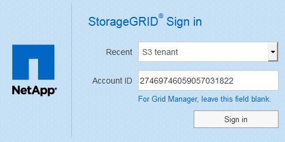

= Inicie sesión en el Administrador de inquilinos
:allow-uri-read: 
:icons: font
:imagesdir: ../media/

[role="lead"]
Para acceder al Administrador de arrendatarios, introduzca la dirección URL del arrendatario en la barra de direcciones de un xref:../admin/web-browser-requirements.adoc[navegador web compatible].

.Lo que necesitará
* Debe tener sus credenciales de inicio de sesión.
* Debe tener una dirección URL para acceder al Administrador de inquilinos, tal y como le ha suministrado el administrador de grid. La dirección URL tendrá el aspecto de uno de estos ejemplos:
+
[listing]
----
https://FQDN_or_Admin_Node_IP/
----
+
[listing]
----
https://FQDN_or_Admin_Node_IP:port/
----
+
[listing]
----
https://FQDN_or_Admin_Node_IP/?accountId=20-digit-account-id
----
+
[listing]
----
https://FQDN_or_Admin_Node_IP:port/?accountId=20-digit-account-id
----
+
La URL siempre contiene el nombre de dominio completo (FQDN) o la dirección IP utilizada para acceder a un nodo de administrador, y también puede incluir, de manera opcional, un número de puerto, el ID de cuenta de inquilino de 20 dígitos o ambos.

* Si la URL no incluye el ID de cuenta de 20 dígitos del inquilino, debe tener este ID de cuenta.
* Debe usar un xref:../admin/web-browser-requirements.adoc[navegador web compatible].
* Las cookies deben estar habilitadas en su navegador web.
* Debe tener permisos de acceso específicos.

.Pasos
. Inicie un xref:../admin/web-browser-requirements.adoc[navegador web compatible].
. En la barra de dirección del navegador, introduzca la URL para acceder al Administrador de inquilinos.
. Si se le solicita una alerta de seguridad, instale el certificado con el asistente de instalación del explorador.
. Inicie sesión en el Administrador de inquilinos.
+
La pantalla de inicio de sesión que ve depende de la dirección URL introducida y de si su empresa utiliza el inicio de sesión único (SSO). Verá una de las siguientes pantallas:

+
** La página de inicio de sesión de Grid Manager. Haga clic en el enlace *Ingreso de inquilino* de la parte superior derecha.
+
image::../media/tenant_login_link.gif[Enlace de inicio de sesión de inquilino en la página de inicio de sesión de Grid Manager]

** La página de inicio de sesión del administrador de inquilinos. Es posible que el campo *ID de cuenta* ya esté completo, como se muestra a continuación.
+
image::../media/tenant_user_sign_in.gif[Página de inicio de sesión en el Gestor de inquilinos]

+
... Si no se muestra el ID de cuenta de 20 dígitos del arrendatario, seleccione el nombre de la cuenta de arrendatario si aparece en la lista de cuentas recientes o introduzca el ID de cuenta.
... Introduzca su nombre de usuario y contraseña.
... Haga clic en *Iniciar sesión*.
+
Aparecerá la consola del administrador de inquilinos.

** Si el inicio de sesión único de su organización está habilitado en el grid. Por ejemplo:
+
image::../media/sso_organization_page.gif[Ejemplo de organización Iniciar sesión en la página SSO]

+
Introduzca sus credenciales de SSO estándar y haga clic en *Iniciar sesión*.

** La página de inicio de sesión SSO de inquilino Manager.
+

+
... Si no se muestra el ID de cuenta de 20 dígitos del arrendatario, seleccione el nombre de la cuenta de arrendatario si aparece en la lista de cuentas recientes o introduzca el ID de cuenta.
... Haga clic en *Iniciar sesión*.
... Inicie sesión con sus credenciales SSO estándar en la página de inicio de sesión SSO de su organización.
+
Aparecerá la consola del administrador de inquilinos.

. Si ha recibido una contraseña inicial de otra persona, cambie la contraseña para proteger su cuenta. Seleccione *_username_* > *Change Password*.
+

NOTE: Si SSO está habilitado para el sistema StorageGRID, no puede cambiar la contraseña del administrador de inquilinos.

