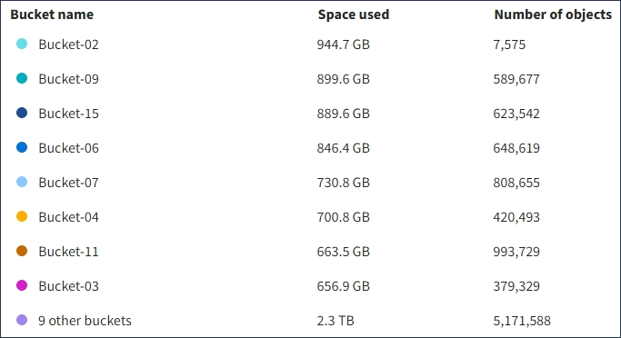

= Comprender la consola del administrador de inquilinos
:allow-uri-read: 
:icons: font
:imagesdir: ../media/

[role="lead"]
La consola de tenant Manager proporciona una información general de la configuración de una cuenta de inquilino y la cantidad de espacio utilizado por los objetos en los bloques de inquilino (S3) o contenedores (Swift). Si el cliente tiene una cuota, en Dashboard se muestra cuánto de la cuota se usa y cuánto queda. Si hay algún error relacionado con la cuenta de inquilino, los errores se muestran en la consola.

IMPORTANT: Los valores de espacio utilizado son estimaciones. Estas estimaciones se ven afectadas por el tiempo de los ingests, la conectividad de red y el estado del nodo.

Cuando se cargan objetos, la consola se parece al siguiente ejemplo:

image::../media/tenant_dashboard_with_buckets.png[Consola - Lista de bloques]

== Resumen de la cuenta de inquilino

La parte superior de la consola contiene la siguiente información:

* El número de bloques o contenedores, grupos y usuarios configurados
* El número de extremos de servicios de plataforma, si se han configurado alguno

Puede seleccionar los enlaces para ver los detalles.

La parte derecha de la consola contiene la siguiente información:

* Número total de objetos para el arrendatario.
+
Para una cuenta de S3, si no se han ingerido objetos y tiene el permiso de acceso raíz, se muestran las directrices de introducción en lugar del número total de objetos.

* Detalles de inquilinos, incluidos el nombre e ID de la cuenta de inquilino y si este puede usar xref:what-platform-services-are.adoc[servicios de plataforma], xref:../admin/using-identity-federation.adoc[su propia fuente de identidad], o. xref:../admin/manage-s3-select-for-tenant-accounts.adoc[S3 Select] (sólo se muestran los permisos habilitados).

== Aprovechamiento del almacenamiento y de la cuota

El panel uso del almacenamiento contiene la siguiente información:

* La cantidad de datos de objeto para el inquilino.
+

IMPORTANT: Este valor indica la cantidad total de datos de objeto cargados y no representa el espacio utilizado para almacenar copias de esos objetos y sus metadatos.

* Si se establece una cuota, la cantidad total de espacio disponible para los datos del objeto y la cantidad y el porcentaje de espacio restante. La cuota limita la cantidad de datos de objetos que se pueden procesar.
+

IMPORTANT: La utilización de cuotas se basa en estimaciones internas y puede superarse en algunos casos. Por ejemplo, StorageGRID comprueba la cuota cuando un inquilino comienza a cargar objetos y rechaza nuevas búsquedas si el inquilino ha superado la cuota. Sin embargo, StorageGRID no tiene en cuenta el tamaño de la carga actual al determinar si se ha superado la cuota. Si se eliminan objetos, es posible que se impida temporalmente que un arrendatario cargue nuevos objetos hasta que se vuelva a calcular la utilización de cuota. El cálculo de la utilización de cuotas puede tardar 10 minutos o más.

* Un gráfico de barras que representa los tamaños relativos de los cubos o contenedores más grandes.
+
Puede colocar el cursor sobre cualquiera de los segmentos del gráfico para ver el espacio total consumido por ese cucharón o contenedor.

+
image::../media/tenant_dashboard_storage_usage_segment.png[Segmento de gráfico de barras]

* Para corresponder con el gráfico de barras, una lista de los cubos o contenedores más grandes, incluida la cantidad total de datos de objeto y el número de objetos de cada cucharón o contenedor.
+

+
Si el inquilino tiene más de nueve cubos o contenedores, el resto de cubos o contenedores se combinan en una sola entrada al final de la lista.

== Alertas de uso de cuotas

Si se han habilitado alertas de uso de cuota en Grid Manager, aparecerán en el Gestor de arrendatarios cuando la cuota sea baja o excedida, de la siguiente manera:

Si se ha utilizado un 90% o más de la cuota de un inquilino, se activa la alerta *uso de cuota de inquilino alto*. Para obtener más información, consulte la referencia de alertas en las instrucciones para supervisar y solucionar problemas de StorageGRID.

image::../media/tenant_dashboard_quota_remaining.png[Cuota restante de la consola de inquilinos]

Si supera la cuota, no podrá cargar nuevos objetos.

image::../media/tenant_dashboard_quota_used.png[Cuota de consola de inquilinos utilizada]

NOTE: Para ver detalles adicionales y gestionar reglas y notificaciones para alertas, consulte las instrucciones para supervisar y solucionar problemas de StorageGRID.

== Errores de punto final

Si ha utilizado Grid Manager para configurar uno o más extremos para utilizarlos con los servicios de la plataforma, el Panel de arrendatarios muestra una alerta si se han producido errores en los últimos siete días.

image::../media/tenant_dashboard_endpoint_error.png[Panel que muestra el mensaje de punto final]

Para ver detalles sobre un error de punto final, seleccione endpoints para mostrar la página endpoints.

.Información relacionada
xref:troubleshooting-platform-services-endpoint-errors.adoc[Solucionar errores de extremos de servicios de plataforma]

xref:../monitor/index.adoc[Supervisión y solución de problemas]
