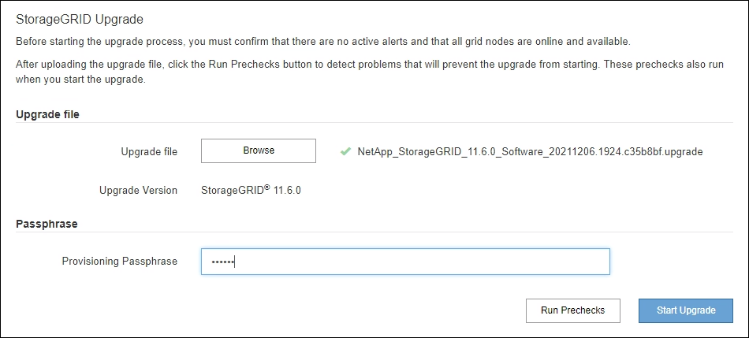
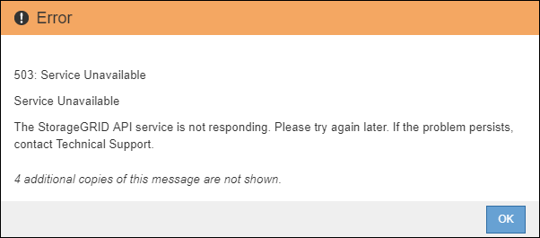

= Realice la actualización
:allow-uri-read: 
:icons: font
:imagesdir: ../media/

[role="lead"]
Cuando esté listo para realizar la actualización, seleccione el `.upgrade` archive e introduzca la clave de acceso de aprovisionamiento. Como opción, puede ejecutar las comprobaciones previas de la actualización antes de realizar la actualización real.

.Lo que necesitará
Ha revisado todas las consideraciones y completado todos los pasos de planificación y preparación.

== Cargue el archivo de actualización

. Inicie sesión en Grid Manager mediante una xref:../admin/web-browser-requirements.adoc[navegador web compatible].
. Seleccione *Mantenimiento* > *sistema* > *actualización de software*.
+
Aparece la página actualización de software.

. Seleccione *StorageGRID Upgrade*.
. En la página StorageGRID Upgrade, seleccione el `.upgrade` archivado.
+
.. Seleccione *examinar*.
.. Localice y seleccione el archivo: `NetApp_StorageGRID_11.6.0_Software_uniqueID.upgrade`
.. Seleccione *Abrir*.
+
El archivo se carga y se valida. Cuando se realiza el proceso de validación, aparece una Marca de verificación verde junto al nombre del archivo de actualización.

. Introduzca la clave de acceso de aprovisionamiento en el cuadro de texto.
+
Los botones *Ejecutar comprobaciones previas* y *Iniciar actualización* se activan.

+

== Realice comprobaciones previas

Opcionalmente, puede validar la condición del sistema antes de iniciar la actualización real. Seleccionar *Ejecutar comprobaciones previas* le permite detectar y resolver problemas antes de iniciar la actualización. Las mismas comprobaciones previas se realizan al iniciar la actualización. Los fallos de comprobación previa detendrán el proceso de actualización y podrían requerir la implicación del soporte técnico para solucionarlos.

. Seleccione *Ejecutar comprobaciones previas*.
. Espere a que se completen las comprobaciones previas.
. Siga las instrucciones para resolver los errores de las comprobaciones previas notificados.
+

IMPORTANT: Si ha abierto algún puerto de firewall personalizado, se le notificará durante la validación de las comprobaciones previas. Debe comunicarse con el soporte técnico antes de continuar con la actualización.

== Inicie la actualización y actualice el nodo de administrador principal

Cuando se inicia la actualización, se realizan comprobaciones previas de actualización y se actualiza el nodo de administración principal, lo cual incluye detener servicios, actualizar el software y reiniciar servicios. No se puede acceder a Grid Manager mientras se actualiza el nodo de administración principal. Además, los registros de auditoría no estarán disponibles. Esta actualización puede llevar hasta 30 minutos.

. Cuando esté listo para realizar la actualización, seleccione *Iniciar actualización*.
+
Aparece una advertencia para recordarle que la conexión del explorador se perderá cuando se reinicie el nodo de administración principal.

+
image::../media/software_upgrade_connection_will_be_lost.png[Se perderá la conexión de actualización de software]

. Seleccione *Aceptar* para confirmar la advertencia e iniciar el proceso de actualización.
. Espere a que se realicen las comprobaciones previas de actualización y a que se actualice el nodo de administrador principal.
+

NOTE: Si se notifica algún error de las comprobaciones previas, solucione y seleccione *Iniciar actualización* de nuevo.

+
Mientras se está actualizando el nodo de administración principal, aparecen varios mensajes *503: Servicio no disponible* y *problema al conectar con el servidor*, que puede ignorar.

+

+
image::../media/software_upgrade_problem_connecting_error.png[Error de conexión al actualizar software]

. Cuando vea el mensaje *400: Bad Request*, vaya al paso siguiente. Se completó la actualización del nodo de administrador.
+
image::../media/software_upgrade_400_error.png[Error de actualización de software 400]

== Borre la caché del navegador y vuelva a iniciar sesión

. Una vez que se haya actualizado el nodo de administración principal, borre la memoria caché del explorador web y vuelva a iniciar sesión.
+
Para obtener instrucciones, consulte la documentación de su navegador web.

+

IMPORTANT: Debe borrar el caché del explorador Web para eliminar los recursos obsoletos utilizados por la versión anterior del software.

+
Aparece la interfaz rediseñada de Grid Manager, que indica que se ha actualizado el nodo de administración principal.

+
image::../media/grid_manager_dashboard.png[Consola de Grid Manager]

. En la barra lateral, seleccione *MANTENIMIENTO* para abrir el menú Mantenimiento.
. En la sección *sistema*, seleccione *actualización de software*.
. En la sección *actualización de StorageGRID*, seleccione *actualización*.
. Revise la sección progreso de la actualización en la página actualización de StorageGRID, que proporciona información acerca de cada tarea de actualización importante.
+
.. *Iniciar servicio de actualización* es la primera tarea de actualización. Durante esta tarea, el archivo de software se distribuye a los nodos de grid y se inicia el servicio de actualización.
.. Una vez completada la tarea *Iniciar servicio de actualización*, se inicia la tarea *Actualizar nodos de cuadrícula*.
.. Mientras la tarea *Actualizar nodos de cuadrícula* está en curso, aparece la tabla Estado del nodo de cuadrícula y muestra la fase de actualización de cada nodo de cuadrícula del sistema.

== Descargue el paquete de recuperación y actualice todos los nodos de grid

. Una vez que los nodos de cuadrícula aparecen en la tabla Estado del nodo de cuadrícula, pero antes de aprobar los nodos de cuadrícula, xref:obtaining-required-materials-for-software-upgrade.adoc#download-the-recovery-package[Descargue una nueva copia del paquete de recuperación].
+

IMPORTANT: Debe descargar una nueva copia del archivo Recovery Package después de actualizar la versión de software en el nodo de administración principal. El archivo de paquete de recuperación permite restaurar el sistema si se produce un fallo.

. Revise la información de la tabla Estado del nodo de cuadrícula. Los nodos de grid se organizan en secciones por tipo: Nodos de administrador, nodos de puerta de enlace de API, nodos de almacenamiento y nodos de archivado.
+
image::../media/software_upgrade_start_grid_node_status.png[Captura de pantalla de los nodos Grid de actualización después de finalizar el nodo de administración]

+
Un nodo de cuadrícula puede estar en una de estas fases cuando aparece por primera vez esta página:

+
** Done (solo nodo de administración principal)
** Preparando actualización
** Descarga de software en cola
** Descarga
** Esperando a que usted apruebe

. Apruebe los nodos de cuadrícula que está listo para agregar a la cola de actualización.
+

IMPORTANT: Cuando la actualización se inicia en un nodo de grid, los servicios de ese nodo se detienen. Más tarde, el nodo de grid se reinicia. Para evitar interrupciones de servicio en las aplicaciones cliente que se comunican con el nodo, no apruebe la actualización de un nodo a menos que esté seguro de que el nodo está listo para detenerse y reiniciarse. Según sea necesario, programe una ventana de mantenimiento o notifique a los clientes.

+
Debe actualizar todos los nodos de grid en el sistema StorageGRID, pero se puede personalizar la secuencia de actualización. Puede aprobar nodos de cuadrícula individuales, grupos de nodos de cuadrícula o todos los nodos de cuadrícula.

+
Si el orden en el que se actualizan los nodos es importante, apruebe los nodos o grupos de nodos de uno en uno y espere a que la actualización se complete en cada nodo antes de aprobar el siguiente nodo o grupo de nodos.

+
** Seleccione uno o más botones *aprobar* para agregar uno o más nodos individuales a la cola de actualización. Si aprueba más de un nodo del mismo tipo, los nodos se actualizarán de uno en uno.
** Seleccione el botón *aprobar todo* de cada sección para agregar todos los nodos del mismo tipo a la cola de actualización.
** Seleccione el botón * aprobar todo* de nivel superior para agregar todos los nodos de la cuadrícula a la cola de actualización.
** Seleccione *Quitar* o *Quitar todo* para eliminar un nodo o todos los nodos de la cola de actualización. No se puede quitar un nodo cuando su etapa alcanza *Servicios de parada*. El botón *Quitar* está oculto.
+
image::../media/software_upgrade_two_nodes_queued.png[Captura de pantalla que muestra que el escenario está deteniendo los servicios]

. Espere a que cada nodo avance por las etapas de actualización, que incluyen Queued, servicios de detención, contenedor, limpieza de imágenes de Docker, actualización de paquetes de sistema operativo base, reinicio, ejecución de pasos después del reinicio, inicio de los servicios y realización de tareas.
+

NOTE: Cuando un nodo de dispositivo alcanza la fase actualizando paquetes de sistema operativo base, el software StorageGRID Appliance Installer del dispositivo se actualiza. Este proceso automatizado garantiza que la versión del instalador de dispositivos StorageGRID permanezca sincronizada con la versión del software StorageGRID.

== Se completó la actualización

Una vez que todos los nodos de grid han completado las fases de actualización, la tarea *Actualizar nodos de grid* se muestra como completada. Las tareas de actualización restantes se realizan automáticamente y en segundo plano.

. Tan pronto como la tarea *Activar características* esté completa (lo que se produce rápidamente), de forma opcional empezar a utilizar las nuevas características en la versión actualizada de StorageGRID.
. Durante la tarea *base de datos de actualización*, el proceso de actualización comprueba cada nodo para verificar que la base de datos de Cassandra no necesita actualizarse.
+

NOTE: La actualización de StorageGRID 11.5 a 11.6 no requiere una actualización de la base de datos de Cassandra; sin embargo, el servicio Cassandra se detendrá y reiniciará en cada nodo de almacenamiento. En las próximas versiones de la función StorageGRID, el paso de actualización de la base de datos de Cassandra podría tardar varios días en completarse.

. Una vez completada la tarea *Actualizar base de datos*, espere unos minutos hasta que finalice la tarea *pasos de actualización final*.
+
Una vez completada la tarea de pasos de actualización final, la actualización se realiza.

== Confirme la actualización

. Confirme que la actualización se completó correctamente.
+
.. En la parte superior de Grid Manager, seleccione el icono de ayuda y seleccione *Acerca de*.
.. Confirme que la versión que se muestra es lo que esperaría.
.. Seleccione *MANTENIMIENTO* > *sistema* > *actualización de software*.
.. En la sección *actualización de StorageGRID*, seleccione *actualización*.
.. Confirme que el banner verde muestra que la actualización del software se ha completado en la fecha y la hora esperados.
+
image::../media/software_upgrade_done.png[Actualización de software realizada]

. En la página actualización de StorageGRID, determine si hay alguna revisión disponible para la versión actual de StorageGRID.
+

NOTE: Si no se muestra ninguna ruta de actualización, es posible que su navegador no pueda comunicarse con el sitio de soporte de NetApp. O bien, la casilla de verificación *Buscar actualizaciones de software* de la página AutoSupport (*SUPPORT* > *Tools* > *AutoSupport*) puede estar desactivada.

. Si hay una revisión disponible, descargue el archivo. A continuación, utilice la xref:../maintain/storagegrid-hotfix-procedure.adoc[Procedimiento de revisión de StorageGRID] para aplicar la revisión.
. Compruebe que las operaciones de grid se han vuelto a la normalidad:
+
.. Compruebe que los servicios funcionan con normalidad y que no hay alertas inesperadas.
.. Confirmar que las conexiones de los clientes con el sistema StorageGRID funcionan tal como se espera.

